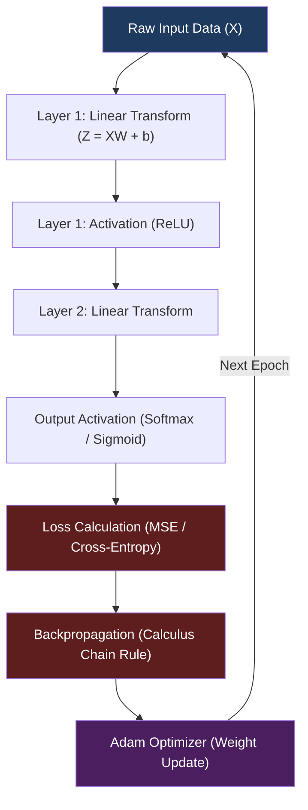

We live in an era where training an artificial intelligence takes exactly three lines of Python. You import PyTorch, define a model, and call `.backward()`. The framework handles the calculus, the memory management, and the optimization. 

But what actually happens underneath that massive layer of abstraction? 

To truly understand mechanistic interpretability and the foundational mathematics of deep learning, I decided to strip away all the modern conveniences. I set a strict rule for my next project: build a complete Multi-Layer Perceptron (MLP) engine using bare metal C++17. 

No PyTorch. No TensorFlow. No NumPy. Not even a linear algebra library like Eigen. Just raw math and memory management.

Here is how I built **Synapse.cpp**.

## The Architecture of a Neuron

Before writing any code, we have to understand the mathematical flow of a neural network. At its core, a network is a series of matrix multiplications followed by non-linear activations. 

Here is the entire data flow mapped out:



## The Matrix Engine: Conquering Memory

The first major hurdle in C++ is memory. Python has a garbage collector that cleans up unused variables. In C++, if you multiply two matrices and forget to free the temporary memory, your program will crash in seconds.

To solve this, I built a custom Matrix class from scratch using flat `double*` arrays stored in row-major order. To ensure memory safety without sacrificing speed, I utilized strict RAII (Resource Acquisition Is Initialization) and Move Semantics.

When a matrix is passed forward through the network, ownership of the heap-allocated memory is transferred using `std::move`. This prevents expensive deep copying and keeps the forward pass incredibly fast.

```cpp
// A simplified look at the custom Matrix dot product implementation
Matrix Matrix::dot(const Matrix& other) const {
    Matrix result(this->rows, other.cols);
    for (size_t i = 0; i < this->rows; ++i) {
        for (size_t j = 0; j < other.cols; ++j) {
            double sum = 0.0;
            for (size_t k = 0; k < this->cols; ++k) {
                sum += this->data[i * this->cols + k] * other.data[k * other.cols + j];
            }
            result.data[i * result.cols + j] = sum;
        }
    }
    return result;
}
```

## The Heart of Learning: Backpropagation

The forward pass is just basic algebra. The actual "learning" happens in the backward pass. Backpropagation is a beautiful application of the calculus chain rule, figuring out exactly how much each specific weight contributed to the final error.

For a network utilizing Mean Squared Error (MSE), the derivation looks like this:

Output Gradient: $\frac{\partial L}{\partial \hat{Y}} = \frac{\hat{Y} - Y}{n}$

Activation Gradient: $\frac{\partial L}{\partial Z} = \frac{\partial L}{\partial A} \odot \sigma'(Z)$

Weight Gradient: $\frac{\partial L}{\partial W} = A^T \cdot \frac{\partial L}{\partial Z}$

Writing this in C++ required building element-wise multiplication routines (the Hadamard product) and matrix transposition algorithms entirely from scratch.

## Optimization: Implementing Adam Without Libraries

Standard Stochastic Gradient Descent (SGD) works, but it can be agonizingly slow to converge on complex datasets. Modern networks use Adam (Adaptive Moment Estimation).

Adam works by keeping track of the exponentially decaying average of past gradients (momentum) and past squared gradients (variance). I coded this directly into the engine, including the crucial bias correction steps:

$$m_t = \beta_1 m_{t-1} + (1 - \beta_1) g_t$$
$$v_t = \beta_2 v_{t-1} + (1 - \beta_2) g_t^2$$
$$W = W - \alpha \frac{\hat{m}_t}{\sqrt{\hat{v}_t} + \epsilon}$$

## Benchmarks and Validation

Code is only as good as its results. To validate the Synapse.cpp engine, I tested it against four classic machine learning benchmarks.

1. **The XOR Problem:** Solved a non-linearly separable problem perfectly using a 2 -> 8 -> 1 architecture with Binary Cross-Entropy.
2. **Circle Dataset:** Successfully classified points inside a strict radius boundary with over 98% accuracy.
3. **Sine Regression:** Approximated a noisy sine wave function achieving a Mean Squared Error of less than $0.0005$.
4. **Gaussian Blobs:** Accurately grouped overlapping clusters utilizing a custom, numerically stable Softmax function.

## Conclusion

Building a neural network engine in C++ is a humbling experience. It forces you to confront the reality of how computationally expensive deep learning actually is. You have to respect the memory limits of your machine, optimize your for loops, and ensure your derivatives are mathematically flawless.

While I will gladly go back to using PyTorch for production deployments, I am a significantly better AI engineer today because I took the time to build the foundation myself. If you want to stop treating AI as a magic black box, I highly recommend trying to build it from the ground up.

Check out the full source code on my GitHub: [Synapse.cpp Repository](https://github.com/TechieSamosa/Synapse.cpp)
